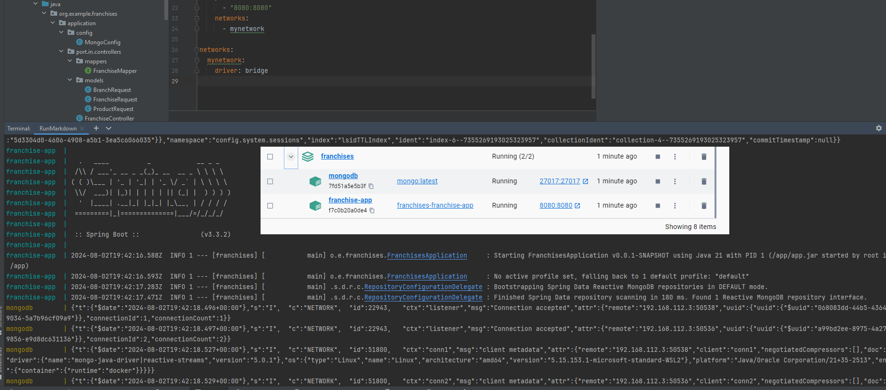
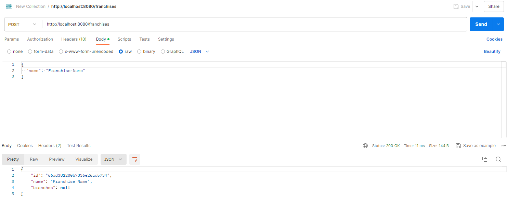

# Franchise API

## Introduction

This project is a Spring Boot application using reactive programming with WebFlux and MongoDB, and mapping with MapStruct.

## Requirements

- Java 21
- Docker
- Maven

## Setup

### Running the Application with Docker

1. Build the Docker images and start the containers:
   ```sh
   docker-compose up --build

Prerequisites
-----------------

There are a few things you'll need to have installed to get this up and running.

**Java**

- [Java 21](https://aws.amazon.com/corretto/)
- [SpringBoot](https://quarkus.io//)
- [MongoDB](https://quarkus.io/guides/mongodb-panache)
- [Docker](https://www.docker.com/)
- [MapStruct (for DTO mapping)](https://mapstruct.org/)
- [Swagger (Documentation)](https://swagger.io/)


**Maven**

- [version 3.9.2](https://maven.apache.org/download.cgi)

### Clone the Repository
```sh
git clone https://github.com/canmios/franchises
cd franchises
```

### Build the Project
```sh
mvn clean install
```

### Start the services:

```sh
docker-compose up --build
```



### Run the Application 
#### After starting the Docker services, you can run the SpringBoot application.


#### REST Services ####
#### Add Franchise.
```
curl -X POST http://localhost:8080/franchises \
-H "Content-Type: application/json" \
-d '{
  "name": "Franchise Name"
}'
```

#### Add Branch
```
curl -X POST http://localhost:8080/franchises/{franchiseId}/branches \
-H "Content-Type: application/json" \
-d '{
  "name": "Branch Name"
}'

```

#### Add Branch
```
curl -X POST http://localhost:8080/franchises/{franchiseId}/branches \
-H "Content-Type: application/json" \
-d '{
  "name": "Branch Name"
}'

```

#### Add Product
```
curl -X POST http://localhost:8080/franchises/{franchiseId}/branches/{branchId}/products \
-H "Content-Type: application/json" \
-d '{
  "name": "Product Name",
  "stock": 100
}'
```

#### Remove a Product from a Branch
```
curl -X DELETE http://localhost:8080/franchises/{franchiseId}/branches/{branchId}/products/{productId} \
-H "Content-Type: application/json"
```

### Get Products with Highest Stock by Branch
```
curl -X GET http://localhost:8080/franchises/{franchiseId}/branches/highest-stock

```


Hexagonal arquitecture.
-----------
Hexagonal Architecture fosters a modular, testable, and maintainable codebase by structuring the application around its core business logic while adapting to various external interfaces through well-defined ports and adapters. This architectural pattern aligns with the project's goals of scalability, maintainability, and flexibility in integrating with external services like MongoDB, RabbitMQ, and others.

Take advantage of built-in Springboot functionality and have good design, code maintenance and including design patterns that are inherent to hexagonal architecture 

Testing
-----------



A reactive programming has been implemented with SpringBoot to improve the concurrency performance, the number of threads 
has been configured to guarantee the transaction load, also the implementation of java 21 that significantly improves 
its virtual machine with a thread management with an improvement in the performance and thread management in the JVM. 


## AWS and Kubernetes Performance Enhancement Alternative

Alternative of improvement with AWS, we can use the services provided with CLOUD and kubernetes to improve much more the performance, as now we have the dockerized image is simple for example deploy the application in EC2 instances, add a gateway and then balance the application with Elastic Load Balancing (ELB).

We can also use AWS EKS (Elastic Kubernetes Service): It simplifies Kubernetes deployment, scaling, and management by offloading the control plane to AWS while allowing you to focus on your applications.

Finally, we can also use Amazon S3 (Simple Storage Service): Utilize S3 for scalable object storage. Store static assets, backups, or other files that application needs.

## Terroform

To integrate Terraform and deploy the application to AWS Cloud, we'll follow these steps:

Set up AWS Infrastructure using Terraform: This includes creating an EC2 instance, a security group, and a MongoDB instance on AWS.
Deploy the Spring Boot application to the EC2 instance.
Connect the Spring Boot application to the MongoDB instance.
Use Docker for packaging and deploying the application

